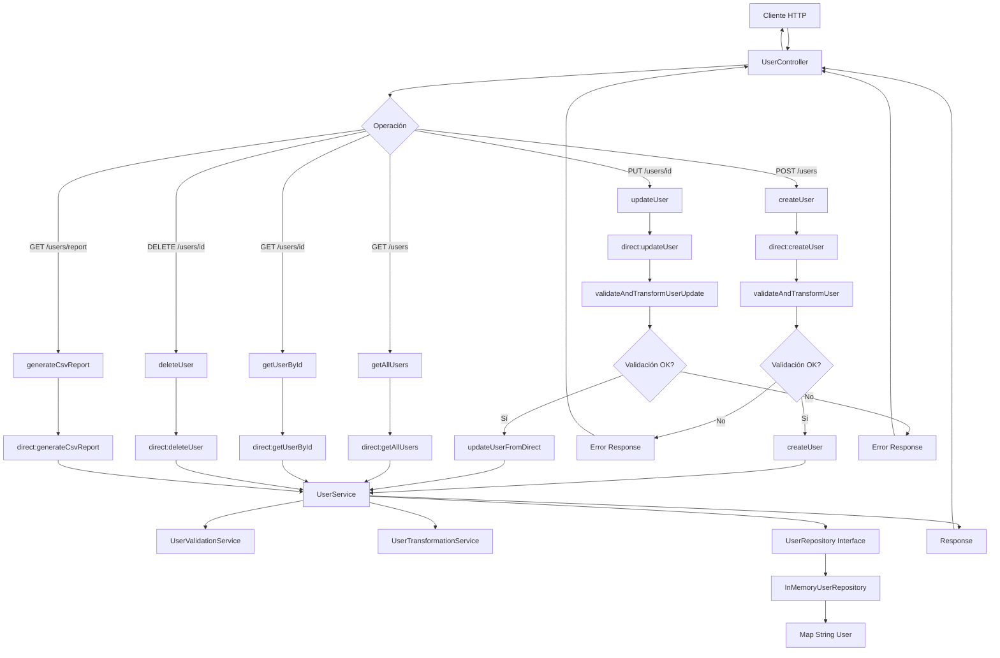

# API REST de Usuarios con Quarkus y Apache Camel

Esta aplicación implementa una API REST para la gestión de usuarios utilizando Quarkus como framework y Apache Camel para el procesamiento de datos, siguiendo los principios de diseño SOLID.

## Características

- ✅ API RESTful completa con endpoints CRUD
- ✅ Validación automática de datos (email, WhatsApp, roles)
- ✅ Transformación automática de datos (asignación de rol por defecto)
- ✅ Almacenamiento en memoria con thread-safety
- ✅ Generación de reportes CSV
- ✅ Documentación OpenAPI/Swagger integrada


## Endpoints Disponibles

### Gestión de Usuarios

- `POST /api/users` - Crear un nuevo usuario
- `GET /api/users` - Listar todos los usuarios
- `GET /api/users/{id}` - Obtener usuario por ID
- `PUT /api/users/{id}` - Actualizar usuario
- `DELETE /api/users/{id}` - Eliminar usuario
- `GET /api/users/report` - Descargar reporte CSV

### Documentación API

- `GET /swagger-ui` - Interfaz Swagger UI

## Estructura del Proyecto

```
src/main/java/com/babeltest/quarkus/
├── model/                              # Entidades y DTOs
│   ├── User.java                       # Entidad principal
│   └── UserRequest.java                # DTO para requests
├── repository/                         # Capa de persistencia
│   ├── UserRepository.java             # Interfaz del repositorio
│   └── InMemoryUserRepository.java     # Implementación en memoria
├── service/                            # Lógica de negocio
│   ├── UserService.java                # Servicio principal
│   ├── UserValidationService.java      # Validaciones
│   └── UserTransformationService.java  # Transformaciones
├── controller/                         # Controladores REST
│   └── UserController.java             # Controlador principal
└── camel/                              # Rutas de Apache Camel
    └── UserRoutes.java                 # Configuración de rutas
```

## Principios SOLID Implementados

### 1. Single Responsibility Principle (SRP)
- Cada clase tiene una responsabilidad específica
- `UserValidationService` solo valida datos
- `UserTransformationService` solo transforma datos
- `InMemoryUserRepository` solo maneja persistencia

### 2. Open/Closed Principle (OCP)
- Las interfaces permiten extensión sin modificación
- `UserRepository` puede implementarse con diferentes tecnologías

### 3. Liskov Substitution Principle (LSP)
- `InMemoryUserRepository` puede sustituir cualquier implementación de `UserRepository`

### 4. Interface Segregation Principle (ISP)
- Interfaces específicas y cohesivas
- `UserRepository` solo expone métodos necesarios

### 5. Dependency Inversion Principle (DIP)
- Dependencias de abstracciones, no implementaciones
- Inyección de dependencias con `@Inject`

## Ejecución

### Prerrequisitos
- Java 17+
- Maven 3.8+

### Desarrollo
```bash
# Compilar y ejecutar en modo desarrollo
./mvnw compile quarkus:dev
```

### Producción
```bash
# Compilar para producción
./mvnw clean package

# Ejecutar JAR
java -jar target/quarkus-app/quarkus-run.jar
```

## Ejemplos de Uso

### Crear Usuario
```bash
curl -X POST http://localhost:8080/api/users \
  -H "Content-Type: application/json" \
  -d '{
    "name": "Juan Pérez",
    "email": "juan@example.com",
    "whatsapp": "+1234567890",
    "role": "admin"
  }'
```

### Obtener Todos los Usuarios
```bash
curl http://localhost:8080/api/users
```

### Obtener Usuario por ID
```bash
curl http://localhost:8080/api/users/{id}
```

### Actualizar Usuario
```bash
curl -X PUT http://localhost:8080/api/users/{id} \
  -H "Content-Type: application/json" \
  -d '{
    "name": "Juan Carlos Pérez",
    "email": "juan.carlos@example.com",
    "whatsapp": "+1234567890",
    "role": "client"
  }'
```

### Eliminar Usuario
```bash
curl -X DELETE http://localhost:8080/api/users/{id}
```

### Descargar Reporte CSV
```bash
curl http://localhost:8080/api/users/report -o users_report.csv
```

## Validaciones Implementadas

### Campos Obligatorios
- `name`: Nombre completo (obligatorio)
- `email`: Email válido (obligatorio)
- `whatsapp`: Número de WhatsApp válido (obligatorio)

### Formatos Válidos
- **Email**: Formato estándar de email
- **WhatsApp**: Número internacional (+1234567890) o nacional (1234567890)
- **Role**: "admin" o "client" (opcional, por defecto "client")

### Transformaciones Automáticas
- Si el campo `role` está vacío, se asigna automáticamente "client"
- Si el campo `role` tiene "admin", se mantiene el valor

## Flujo de la Aplicación

### Diagrama de Arquitectura



### Flujo Detallado por Operación

#### 1. **Crear Usuario (POST /api/users)**
```
Cliente → UserController.createUser() 
       → direct:createUser (Camel Route)
       → validateAndTransformUser() 
       → UserValidationService (validaciones)
       → UserTransformationService (asignar rol "client")
       → UserService.createUser()
       → InMemoryUserRepository.save()
       → Map<String, User> (almacenamiento)
       → Response JSON
```

#### 2. **Obtener Todos los Usuarios (GET /api/users)**
```
Cliente → UserController.getAllUsers()
       → direct:getAllUsers (Camel Route)
       → UserService.getAllUsers()
       → InMemoryUserRepository.findAll()
       → Map<String, User> (lectura)
       → Response JSON Array
```

#### 3. **Obtener Usuario por ID (GET /api/users/{id})**
```
Cliente → UserController.getUserById()
       → direct:getUserById (Camel Route)
       → UserService.getUserById()
       → InMemoryUserRepository.findById()
       → Map<String, User> (búsqueda)
       → Response JSON
```

#### 4. **Actualizar Usuario (PUT /api/users/{id})**
```
Cliente → UserController.updateUser()
       → direct:updateUser (Camel Route)
       → validateAndTransformUserUpdate()
       → UserValidationService (validaciones)
       → UserTransformationService (transformaciones)
       → UserService.updateUser()
       → InMemoryUserRepository.update()
       → Map<String, User> (actualización)
       → Response JSON
```

#### 5. **Eliminar Usuario (DELETE /api/users/{id})**
```
Cliente → UserController.deleteUser()
       → direct:deleteUser (Camel Route)
       → UserService.deleteUser()
       → InMemoryUserRepository.delete()
       → Map<String, User> (eliminación)
       → Response Boolean
```

#### 6. **Generar Reporte CSV (GET /api/users/report)**
```
Cliente → UserController.generateCsvReport()
       → direct:generateCsvReport (Camel Route)
       → UserService.getAllUsers()
       → InMemoryUserRepository.findAll()
       → Map<String, User> (lectura)
       → Generación CSV en memoria
       → Response CSV File
```

### Capas de la Aplicación

1. **Capa de Presentación**: `UserController` - Maneja las peticiones HTTP
2. **Capa de Enrutamiento**: `UserRoutes` (Apache Camel) - Procesa y enruta datos
3. **Capa de Servicios**: `UserService`, `UserValidationService`, `UserTransformationService` - Lógica de negocio
4. **Capa de Persistencia**: `UserRepository` (interfaz) → `InMemoryUserRepository` (implementación)
5. **Capa de Datos**: `Map<String, User>` - Almacenamiento en memoria

### Validaciones y Transformaciones

- **Validaciones**: Email, WhatsApp, roles, campos obligatorios
- **Transformaciones**: Asignación automática de rol "client" si está vacío
- **Manejo de Errores**: Respuestas HTTP apropiadas con mensajes descriptivos

## Logging

La aplicación incluye logging detallado en:
- Operaciones de usuarios
- Validaciones y transformaciones
- Errores y excepciones
- Procesamiento de rutas Camel

## Testing

Para ejecutar las pruebas:
```bash
./mvnw test
```

## Docker

### Construir imagen
```bash
./mvnw package -Dquarkus.container-image.build=true
```

### Ejecutar contenedor
```bash
docker run -i --rm -p 8080:8080 quarkus-api:1.0.0-SNAPSHOT
```

## Contribución

1. Fork el proyecto
2. Crea una rama para tu feature (`git checkout -b feature/AmazingFeature`)
3. Commit tus cambios (`git commit -m 'Add some AmazingFeature'`)
4. Push a la rama (`git push origin feature/AmazingFeature`)
5. Abre un Pull Request

## Licencia

Este proyecto está bajo la Licencia MIT - ver el archivo [LICENSE](LICENSE) para detalles.